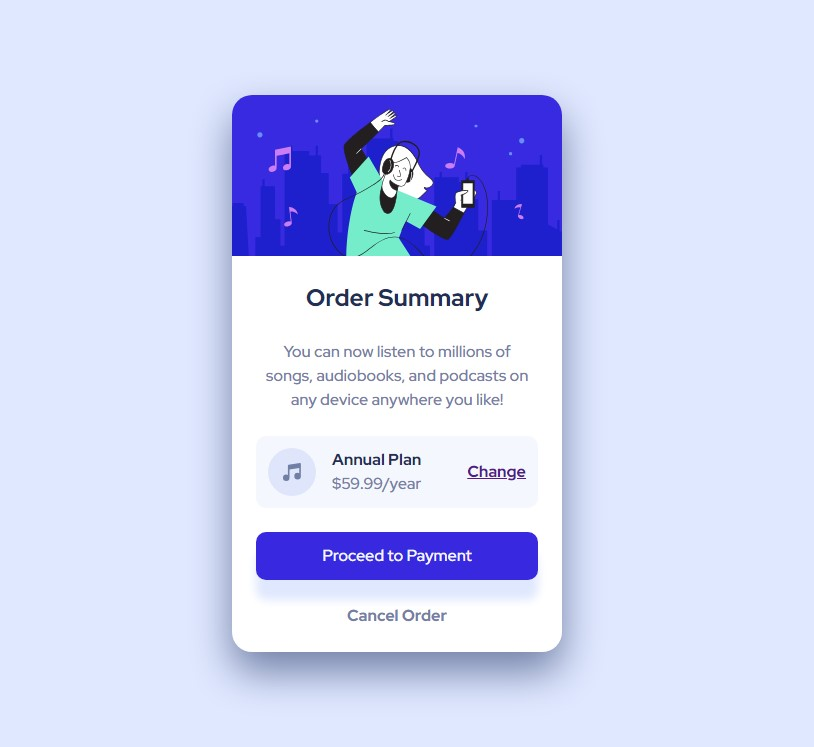

# Frontend Mentor - Results summary component solution

This is a solution to the [Results summary component challenge on Frontend Mentor](https://www.frontendmentor.io/challenges/results-summary-component-CE_K6s0maV). Frontend Mentor challenges help you improve your coding skills by building realistic projects.

## Table of contents

-   [Overview](#overview)
    -   [The challenge](#the-challenge)
    -   [Screenshot](#screenshot)
    -   [Links](#links)
-   [My process](#my-process)
    -   [Built with](#built-with)
    -   [What I learned](#what-i-learned)
    -   [Continued development](#continued-development)
    -   [Useful resources](#useful-resources)
-   [Author](#author)
-   [Acknowledgments](#acknowledgments)

## Overview

### The challenge

Users should be able to:

-   [x] View the optimal layout for the interface depending on their device's screen size
-   [x] See hover and focus states for all interactive elements on the page
-   [x] **Bonus**: Use the local JSON data to dynamically populate the content

### Screenshot

### Links

-   Challenge URL: [Order summary component](https://www.frontendmentor.io/challenges/order-summary-component-QlPmajDUj)
-   Repository URL: [Github Repo](https://github.com/hornjbl/WebDev-FrontEndMentor/tree/main/newbie/004-order-summary-component-main/004-01)
-   Live Site URL: [Live site URL](https://hornjbl.github.io/WebDev-FrontEndMentor/newbie/004-order-summary-component-main/004-01/index.html)

## My process

### Built with

-   Semantic HTML5 markup
-   CSS custom properties
-   Flexbox
-   CSS Grid
-   Mobile-first workflow
-   Javascript

### What I learned

### Continued development

### Useful resources

## Author

-   Github - [hornjbl](https://github.com/hornjbl)
-   Frontend Mentor - [@hornjbl](https://www.frontendmentor.io/profile/hornjbl)

## Acknowledgments
